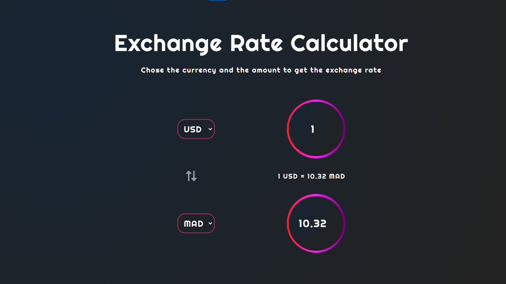

# Currency-Exchange-Rates
simple website that help you to know your country currency exchange rates.

## view [  Currency-Exchange-Rates]( https://er-med.github.io/Currency-Exchange-Rates/)
## 🔗 Contact me

 Gmail : mohamedermili5@gmail.com;

